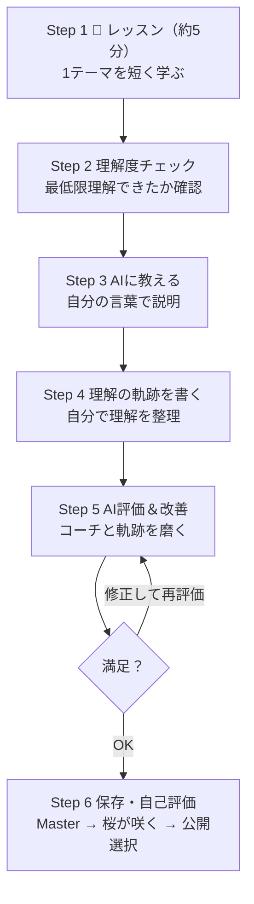

# LOBlossom 開発企画書

> **この資料について**  
> LOBlossom が「なぜ存在するのか」「なぜその機能が必要なのか」を、誰でも理解できるレベルまで具体化した企画書です。  
> 機能一覧を並べる資料ではなく、**理解が育ち、花咲いていく体験**を最優先に記述しています。

---

## 1. LOBlossom とは何か

### 1.1 存在理由 —— 理解が花咲く場所

多くの学習サービスは **「知識を増やすサービス」** です。  
レッスンを配信し、問題を出し、正解率を上げる。学習者は「何を覚えるか」に向き合います。

LOBlossom は **「理解が花咲く体験を届けるサービス」** です。  
知識を詰め込むのではなく、一人ひとりの **理解が少しずつ育ち**、**自分だけの学び方が花開いていく** 過程そのものを大切にします。

LOBlossom は英語を教えるアプリでも、特定の科目専用ツールでもありません。  
数学・資格・語学・仕事のスキル—— **題材は何でもよい** 。  
大切なのは、学習者が **自分に合った学び方を見つけ**、**自分一人でも理解を育て続けられる** ようになることです。

### 1.2 解決したい課題

| 学習者の悩み | 一般的なサービスの限界 | LOBlossom のアプローチ |
|--------------|------------------------|------------------------|
| 勉強したつもりなのに定着しない | 正解・不正解で終わる | 自分の言葉で説明し、理解が育つプロセスを可視化する |
| 何がわかっていないかわからない | 答えを教える | コーチが優しく伴走し、理解の芽に光を当てる |
| 理解したことを自分のものにできない | 完成品を自動生成する | AI は下書きを提案するが、**理解の軌跡** はユーザー自身が完成させる |
| このやり方が他の勉強にも使えるかわからない | 科目ごとに完結する | **理解の軌跡** が積み重なり、学び方そのものを育てる |
| 一人だと続かない | コンテンツ消費で終わる | Master 獲得と桜が咲く演出で、成長を実感しながら続けられる |

### 1.3 最も重要な価値

**「知識を増やす」のではなく、「理解を育て、花咲かせる」。**

この違いが LOBlossom の根幹です。  
正解を増やすことより、**次に一人で勉強するときも、自分の理解を育てられる学び方** を手に入れることが、LOBlossom が目指す成果です。

---

## 2. ブランドと世界観

### 2.1 名称の意味 —— Blossom

**LOBlossom** —— **理解が花開く（Blossom）** 瞬間を、一人ひとりの **ループ（Loop）** として積み重ねていく。

名前に込めたのは、「わかった」という一瞬の完結ではなく、**理解が芽生え、育ち、やがて花咲く** という過程への敬意です。

### 2.2 桜（さくら）の世界観

LOBlossom のビジュアルと言葉には、**桜** のイメージを込めます。

| 桜が象徴するもの | LOBlossom での意味 |
|------------------|-------------------|
| 成長 | 理解が段階的に育ち、やがて花咲くプロセス |
| 積み重ね | 1つの **理解の軌跡** が、次の理解の土壌になる |
| 継続 | 一輪で終わらない。軌跡が増えるほど、学び方の木が育つ |
| 花咲き | 1レッスン完了のたび、桜が咲く演出で **成長を実感** する |

桜は「最初から完璧な花」ではありません。  
**芽 → つぼみ → 花びら → 花咲き** と、段階を踏んで育つものです。

LOBlossom も、一度で完璧な理解を求めません。  
ユーザーが理解を整理し、コーチと磨き、**自分だけの理解の軌跡を完成させる** —— その積み重ねが、やがて **Master 獲得** と **桜が咲く瞬間** につながります。

### 2.3 理解の軌跡 —— 学習の成果物

LOBlossom では「ノート」「学習記録」という表現を使いません。  
学習の成果は **理解の軌跡** として積み重なります。

**理解の軌跡** は、単なるまとめ資料ではありません。  
学習者が AI との対話を通して理解を深め、**その理解が少しずつ育ち、花開いていく過程** を、自分の言葉で残したものです。

- AI は下書きを提案できますが、**完成させるのは必ずユーザー**
- 毎日の **理解の軌跡** が積み重なるほど、自分の成長が見えてくる
- 1レッスン完了ごとに **Master 獲得** → **桜が咲く演出** で、達成感と継続のモチベーションを届ける

### 2.4 Master —— 花咲いた証

**Master** は、1レッスンを最後まで走り切った証です。  
知識を「完全に習得した」という意味ではなく、**理解の Loop を1周し、理解の軌跡を残した** という達成の印です。

Master を獲得するたびに **桜が咲く演出** が起こり、ユーザーは自分の成長を実感します。  
積み重なった Master と **理解の軌跡** が、LOBlossom における **自分の学びの木** を育てていきます。

---

## 3. サービスの軸

### 3.1 「何を学ぶか」ではなく「どう育てるか」

LOBlossom のレッスンは、特定の知識を詰め込むためだけのものではありません。  
レッスンは **「今回、この題材で、理解を育ててみる」** ための **種をまく場** です。

ユーザーが持ち帰るのは、題材の正解そのものではなく、

- 自分の言葉で説明したとき、理解のどこが育ったか
- 理解の軌跡を書き、コーチと磨いたとき、何が花開いたか
- 次に一人で勉強するとき、どうすれば理解を育てられるか

という **理解の育て方** です。

### 3.2 ターゲットユーザー

**勉強方法がわからず悩んでいる学生・社会人**

- 資格・語学・数学・仕事スキルなど、題材は多様
- 「読んだ・解いた」で終わってしまい、理解が育った実感がない
- 他人の解説を見ても、自分の中で花開かない
- 長期的に、**誰かに頼らず、自分で理解を育て続けたい** と感じている

LOBlossom は、こうした人に **最初の「理解の育て方」** を体験させ、**理解の軌跡** を通じて **自分だけの学び方を花開かせる** 場所です。

---

## 4. AI の役割

### 4.1 AI は先生ではない —— 優しい学習コーチ

LOBlossom の AI は **先生** ではありません。  
厳しく採点し、答えを示し、正解を教える存在でもありません。

AI は **優しく、自分で気付けるように導いてくれる学習コーチ** です。  
理解の **花を咲かせる** のはユーザー自身であり、AI はその **育成を支える** 存在です。

| コーチがすること | コーチがしないこと |
|------------------|-------------------|
| 理解できている部分を褒める | 答えを直接教える |
| 理解不足の部分を優しく指摘する | 正解を先回りして示す |
| 気付きを与える問いを届ける | ユーザーの代わりに考える |
| 「もう少し自分の言葉で」と改善を促す | 一方的に解説する |

### 4.2 コーチの口調 —— LOBlossom らしい伴走

AI コーチは、次のような言葉でユーザーを支えます。

- 「ここはどう思う？」
- 「別の例でも説明できそう？」
- 「いいところまで来ています」
- 「もう一歩だけ考えてみよう」

答えをすぐ教えるのではなく、**ユーザーが自分で理解を深められる** ようにサポートします。  
責めず、急がせず、**理解が育っていること** を先に認めてから、次の一歩を提案します。

### 4.3 AI が関わる2つの場面（MVP）

MVP では、AI コーチは **2つのステップ** でユーザーに伴走します。

**Step 3：AI に教える（説明を聴く）**  
ユーザーが学んだ内容を自分の言葉で説明します。  
AI は採点せず、説明を聴き、必要に応じて **伝え方のバリエーション** を促します（例：「友達に教えるつもりで」「小学生にも分かるように」「例を使って」）。  
目的は **フェイマン・テクニック** による理解の定着です。

**Step 5：AI 評価＆改善（理解の軌跡を磨く）**  
ユーザーが書いた **理解の軌跡** に対して、コーチとしてフィードバックします。

- 理解できている部分を褒める
- 理解不足の部分を優しく指摘する
- 気付きを与える問いをする
- 「もう少し自分の言葉で書いてみよう」など改善を促す

ユーザーは修正後、**再度 AI に評価してもらえる** 。  
完璧を求めるのではなく、**自分の言葉で理解が深まる** まで、短いラウンドを重ねます。

### 4.4 問いの目的 —— 花咲きを促すための足場

AI が問いかけること自体が目的ではありません。  
問いは、理解が **さらに育ち、花咲く** ための足場として使われます。

| 問いの目的 | 具体例 |
|------------|--------|
| 理解が本当に育っているか確認する | 「その説明だと、〇〇の場合はどうなりますか？」 |
| まだ育っていない部分を見つける | 「さっきの説明では、△△の部分が省略されていませんか？」 |
| 別の例でも理解が花咲くか確かめる | 「別の例で言い換えると、どう説明しますか？」 |
| 理解をさらに深く育てる | 「なぜそうなるのか、もう一段階掘り下げると？」 |

---

## 5. 理解の軌跡 —— LOBlossom らしさの核心

### 5.1 「自動完成」ではなく「自分で整理する場所」

LOBlossom で最も大切なのは、**ユーザー自身が理解を整理する** Step 4 です。

「AI が自動で完成したノートを作る」のではありません。  
**理解の軌跡** というタイトルのもと、ユーザーが自分の言葉で理解を整理します。

AI は下書きを提案できます。  
しかし **完成させるのは必ずユーザー** です。

```
自分の言葉で AI に説明（Step 3）
        ↓
  ユーザーが理解の軌跡を書く（Step 4）
  ※ AI は下書きを提案可能
        ↓
  AI コーチが評価＆改善を提案（Step 5）
        ↓
  ユーザーが修正 → 必要なら再評価
        ↓
  理解の軌跡を保存 → 花咲きの瞬間へ（Step 6）
```

この **「自分の手で仕上げる」** 工程が、理解を自分のものにします。

### 5.2 理解の軌跡 —— 初期フォーマット（MVP）

MVP では、レッスン1（例：「be動詞とは何か？」）向けに、次のフォーマットを用意します。

| # | 見出し | 意味 |
|---|--------|------|
| ① | be動詞とは？ | 題材の核心を、自分の言葉で |
| ② | どう使う？ | 使い方・応用を、自分なりに整理 |
| ③ | 大事だったポイント | 理解が花開いた決め手 |
| ④ | 次に気を付けたいこと | まだつぼみの部分、次の芽 |

題材が変わっても、この **4つの問い** の構造は再利用できます。  
ユーザーはこの枠を埋めることで、**理解がどう育ったか** を自分の言葉で残します。

### 5.3 軌跡が積み重なるほど、木が育つ

1つの **理解の軌跡** は、桜の **一輪** です。  
完璧でなくてよい。下書きから始まり、コーチと磨き、ユーザーが完成させる。

**理解の軌跡** が増えるほど、ユーザーの **学び方の木** が育ち、  
**Master** と **桜が咲く演出** を通じて、**自分の成長を実感** できる——それが LOBlossom の世界観です。

---

## 6. 他サービスとの差別化

### 6.1 二種類の学習サービス

```
【知識を増やすサービス】            【理解を育て、花咲かせるサービス】
  ・正解・スコアが中心                 ・理解の成長・気付きが中心
  ・コンテンツ消費                     ・自分の言葉での説明と整理
  ・答えを教える                       ・コーチが伴走する
  ・完成品を自動生成                   ・理解の軌跡を自分で完成させる
  ・科目ごとに完結                     ・理解の育て方を他の題材へ持ち越す

              ↑ 多くの学習アプリ            ↑ LOBlossom
```

### 6.2 LOBlossom だけが届けるもの

- **題材を超えた理解の育て方** … 説明 → 整理 → 改善の型を、次の勉強でも使える
- **理解の軌跡** … 他人のまとめではなく、自分の理解が花咲いた過程
- **優しい AI コーチ** … 答えではなく、褒め・指摘・問い・改善提案で伴走
- **花咲きの達成感** … Master 獲得と桜が咲く演出で、成長を実感できる

---

## 7. ユーザー体験（MVP）

MVP は **レッスン1本** を、以下の **6ステップ** で完走する体験です。  
機能を増やすのではなく、**理解が花咲く一連の流れ** として設計します。

### 7.1 レッスン1の流れ —— 全体像



---

### Step 1：レッスン（約5分）

**目的：** 1つのテーマを短く学び、あとで説明するための **種** を得る。

| 項目 | 内容 |
|------|------|
| 時間 | 約5分 |
| 題材例 | 「be動詞とは何か？」 |
| 分量 | できるだけシンプル。初心者でも5分程度で理解できる量 |
| ユーザーが感じること | 「今日はこのテーマで、理解を育ててみる」—— 詰め込みではなく、**あとで自分の言葉にする材料** を集める感覚 |

---

### Step 2：理解度チェック

**目的：** 「全部覚えたか」ではなく、**「最低限理解できたか」** を確認する。

| 項目 | 内容 |
|------|------|
| 問題数 | 3〜5問程度 |
| 形式 | 穴埋め・選択・並び替えなど、簡単なもの |
| ユーザーが感じること | テストのような緊張感ではなく、**「説明に進んで大丈夫そう」** と自分を確かめる軽さ。間違えても責めない |

---

### Step 3：AI に教える

**目的：** フェイマン・テクニックによる **理解の定着** 。  
学んだ内容を、**自分の言葉で** AI に説明する。

AI は毎回、少し違う **伝え方** を促してよい。

| 促し方の例 |
|-----------|
| 「友達に教えるつもりで説明してください。」 |
| 「小学生にも分かるように説明してください。」 |
| 「例を使って説明してください。」 |

**ユーザーが感じること：**  
最も能動的な時間。AI は採点せず **説明を聴く** 。  
自分の言葉にした瞬間、理解の輪郭が見えてくる。

---

### Step 4：理解の軌跡を書く

**目的：** LOBlossom らしさを表す **最も重要なステップ** 。  
ユーザー自身が理解を整理し、**理解の軌跡** を完成させる。

| 項目 | 内容 |
|------|------|
| タイトル | **理解の軌跡** |
| AI の関与 | 下書きを提案 **できる** が、完成は **必ずユーザー** |
| 初期フォーマット | ① be動詞とは？ ② どう使う？ ③ 大事だったポイント ④ 次に気を付けたいこと |

**ユーザーが感じること：**  
他人のまとめをコピーするのではなく、**自分の理解を自分の言葉で並べる** 。  
「なぜ理解できたか」「何が大事だったか」が、初めて言語化される。

---

### Step 5：AI 評価＆改善

**目的：** 理解の軌跡を、コーチと一緒に **磨く** 。

AI コーチの役割：

- 理解できている部分を **褒める**
- 理解不足の部分を **優しく指摘する**
- **気付きを与える問い** をする
- 「もう少し自分の言葉で書いてみよう」など **改善を促す**

| 項目 | 内容 |
|------|------|
| 再評価 | ユーザーが修正後、**再度 AI に評価してもらえる** |
| ユーザーが感じること | 試験ではなく、**一緒に良くしていく伴走** 。「いいところまで来ています」と言われ、自分で直したくなる |

---

### Step 6：保存・自己評価 —— 花咲きの瞬間

**目的：** 達成感と成長の実感。最後まで走り切った **ご褒美** 。

```
理解の軌跡を保存
        ↓
自己評価（理解できた・少し難しかった 等）
        ↓
Master 獲得
        ↓
桜が咲く演出
        ↓
公開するか選択
```

| 項目 | 内容 |
|------|------|
| 自己評価 | 「理解できた」「少し難しかった」など、自分の感覚を選ぶ |
| Master | 1レッスン完走の証。知識の完全習得ではなく、**Loop を1周した** 達成 |
| 桜が咲く演出 | 成長を視覚的に実感する、LOBlossom らしいクライマックス |
| 公開選択 | 理解の軌跡を公開するか、自分だけに残すかを選べる |

**ユーザーが感じること：**  
「今日、理解が1輪花開いた」。  
積み重なった **理解の軌跡** と **Master** が、明日も学びたくなる理由になる。

---

### 7.2 MVP 機能一覧（6ステップ対応）

| Step | 機能 | ユーザーにとっての意味 |
|------|------|------------------------|
| 1 | レッスン（約5分） | 理解の **種** に触れる |
| 2 | 理解度チェック（3〜5問） | **最低限理解できたか** を軽く確認 |
| 3 | AI に教える | フェイマン・テクニックで理解を定着 |
| 4 | 理解の軌跡を書く | **自分で理解を整理** する、最重要ステップ |
| 5 | AI 評価＆改善 | コーチと軌跡を磨く（修正→再評価可） |
| 6 | 保存・自己評価 | Master → 桜が咲く → 公開選択 |

---

## 8. 成功の定義

LOBlossom の成功は、**「その題材の知識を増やせたこと」** でも、**「その場で理解できたこと」** でもありません。

### 8.1 MVP の成功 —— 理解の花咲きは、一人でも続けられる

| 成功の姿 | 具体的な兆候 |
|----------|--------------|
| **自分に合った理解の育て方を見つける** | 「説明して、軌跡を書いて、直す——この型が自分に合う」と自覚する |
| **その育て方を他の勉強でも使える** | 「次の単元も、同じ流れでやってみよう」と自然に思う |
| **最終的には一人でも理解を花咲かせ続けられる** | AI がなくても、説明→整理→磨く、を一人で回せる |

### 8.2 測るべきこと —— 花咲きの兆し

- **理解の軌跡** を自分で書き、完成させたか
- Step 5 で修正し、**自分の言葉で深められた** 実感があるか
- Step 6 の **Master 獲得・桜が咲く演出** で達成感を感じたか
- セッション後、**「次も Loop を回したい」** と思えるか

正解率やスコアは、LOBlossom の主目的ではありません。

---

## 9. 技術構成（MVP 向け）

世界観を体験として届けるための **最小限の技術選定** です。

| レイヤー | 選定 | 世界観との関係 |
|----------|------|--------------|
| フロント | Next.js + React | 6ステップの Loop を一画面ずつ丁寧に作れる |
| スタイル | Tailwind CSS | 桜・成長・花咲きの世界観を UI に反映 |
| AI | OpenAI API 等 | **優しいコーチ** としてのプロンプト設計が核心 |
| 保存（MVP） | localStorage → 後に Supabase | 理解の軌跡を手元に残す |
| ホスティング | Vercel | Web から始め、理解を育てる入口を低く保つ |

**AI プロンプト設計の原則（開発時の指針）**

- 正解を先に言わない
- 「いいところまで来ています」—— 褒めてから改善を促す
- Step 3：伝え方のバリエーション（友達・小学生・例を使って）をローテーション
- Step 5：理解の軌跡に対し、褒め・優しい指摘・問い・改善提案。再評価に対応
- 下書き（Step 4）は **要点＋ユーザーの言葉** をベースに。完成はユーザーに委ねる

**Step 6 演出（開発時の指針）**

- Master 獲得バッジまたは表示
- 桜が咲くアニメーション（CSS / Lottie 等）
- 自己評価 UI（理解できた / 少し難しかった 等）
- 公開 / 非公開の選択

---

## 10. 開発フェーズ

**6ステップの体験** が伝わるかを確認しながら進めます。

### Phase 0：企画確定 ✅

- コンセプト・AI の役割・理解の軌跡・6ステップ・Master・花咲き演出を明文化

### Phase 1：体験の骨組み

- 画面遷移：Step 1 → 2 → 3 → 4 → 5 → 6
- レッスン1（be動詞）のダミーデータで **6ステップ完走** を確認
- 桜・花咲きのトーンを UI に反映

### Phase 2：コア体験の実装

- AI コーチ（Step 3：説明を聴く / Step 5：評価＆改善・再評価）
- 理解の軌跡エディタ（Step 4：下書き提案 → ユーザーが完成）
- Step 6：保存・自己評価・Master・桜が咲く演出・公開選択
- **「答えを教えていないか」** をプロンプトと体験の両方で検証

### Phase 3：花咲きの検証

- 自分または知り合い1人に触ってもらう
- 聞くこと：Step 4 で自分の言葉になったか / Step 6 で達成感があったか / 次もやりたいか
- 成功の定義（8章）に照らして改善

### Phase 4：MVP 以降（スコープ外の参考）

- ログイン・クラウド保存
- レッスン2以降の追加
- 理解の軌跡一覧・振り返り
- Master の累積と学びの木の可視化

---

## 11. まだ決めたいこと（次の対話）

6ステップの骨格は固まりました。Phase 1 に進む前に、次を決めると実装がスムーズです。

1. **レッスン1の具体コンテンツ** … 「be動詞とは何か？」の5分レッスン本文
2. **理解度チェックの3〜5問** … 穴埋め・選択・並び替えの具体問題
3. **公開機能の範囲（MVP）** … 公開先（URL共有 / フィード内 / 非公開のみ 等）

---

## 付録：用語集

| 用語 | 意味 |
|------|------|
| **LOBlossom** | 一人ひとりの理解が育ち、花咲いていく体験を届けるサービス |
| **Blossom（花咲く）** | 理解が段階的に育ち、やがて自分の中で花開く瞬間 |
| **理解の軌跡** | 学習の成果物。自分の言葉で残した、理解が花咲いた過程 |
| **Master** | 1レッスンを最後まで走り切った証。Loop を1周した達成 |
| **桜が咲く演出** | Master 獲得時に起こる、成長を実感するビジュアル演出 |
| **AI コーチ** | 優しく伴走する存在。褒め・指摘・問い・改善提案。答えは教えない |
| **Loop** | Step 1〜6 を1周する、1レッスン分の理解の循環 |
| **種** | レッスンで触れるテーマ。理解を育てるための出発点 |
| **下書き** | Step 4 で AI が提案できる理解の軌跡のたたき台。完成はユーザー |
| **自己評価** | Step 6 でユーザーが選ぶ、自分の理解感覚（理解できた / 少し難しかった 等） |

---

*最終更新：2026年8月5日*
